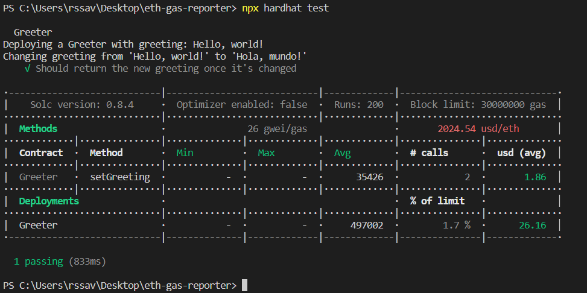

# Using eth-gas-reporter
This is a sample hardhat project with eth-gas-reporter

## Steps:
- Create a sample hardhat project using ```npx hardhat``` <br>
- Download some dependencies: <br>
    ```npm i hardhat-gas-reporter``` <br> 
    ```npm i dotenv``` <br>
- create .env file as showed in _.env from the code above <br>
    - get your API key from https://coinmarketcap.com/api/pricing/ <br>
- copy the hardhat.config.js from the code above <br>
- enter the following command in terminal to see the results: <br>
    ```npx hardhat test``` <br>

## Output:
